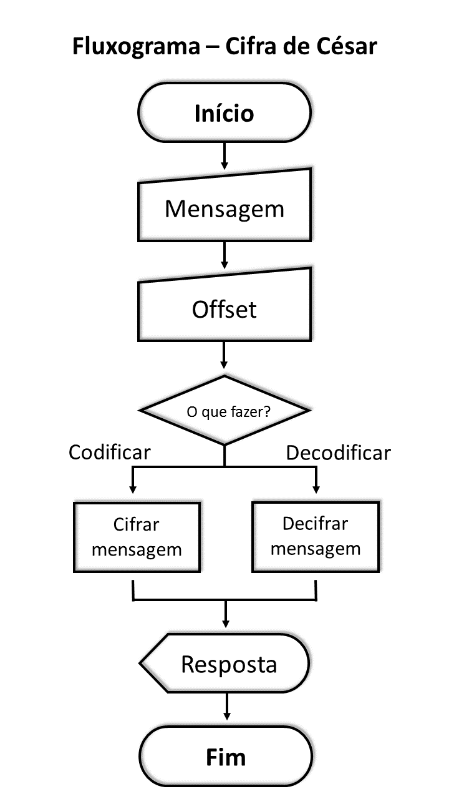
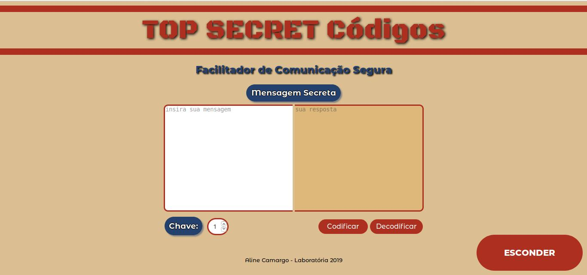
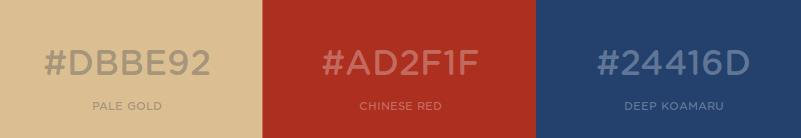

# Cifra de César

## Índice

1. [Problema](#1.-Problema)
2. [Como Utilizar](#2.-Como-utilizar)
3. [Lógica da Cifra](#3.-Lógica-da-Cifra)
4. [Interface](#4.-Interface)
5. [Especificações Técnicas](#5.-Especificações-Técnicas)
6. [Objetivos de aprendizagem atingidos](#6.Objetivos-de-aprendizagem-atingidos)

## 1. Problema

Pensando principalmente nos agentes infiltrados em organizações criminosas que
lidam com situações de alta exposição e perigo de vida e também nas organizações
de segurança que precisam se comunicar com esses agentes de campo, o site Top
Secret Códigos foi criado para facilitar e agililzar a encriptação das mensagens
trocadas entre estes.

## 2. Como utilizar

O usuário insere o texto no local indicado, ajusta sua chave de
deslocamento (_offset_) e escolhe se quer codificar ou decodificar sua mensagem,
então o resultado aparece na tela ao lado da mensagem inicial. No caso do
usuário não ajustar a chave de deslocamento, o valor _default_ é 1.

## 3. Lógica da Cifra

A encriptação ocorre de acordo com a [cifra de César](https://pt.wikipedia.org/wiki/Cifra_de_C%C3%A9sar),
uma das técnicas mais simples de cifrar uma mensagem. É um tipo de cifra
por substituição, em que cada letra do texto original é substituida por outra
que se encontra há um número fixo de posições (deslocamento) mais a frente do
mesmo alfabeto.

Por exemplo se usarmos o deslocamento (_offset_) de 3 posições:

* Alfabeto sem cifrar: A B C D E F G H I J K L M N O P Q R S T U V W X Y Z
* Alfabeto com cifra:  D E F G H I J K L M N O P Q R S T U V W X Y Z A B C
* A letra A será D
* A palavra CASA será FDVD

Por ser uma cifra de substituição alfabética simples, é prevista para o futuro
do site a inclusão de processos de cifragem mais complexos, portanto mais
seguros.

## 4. Interface

A interface foi definida pensando em um design básico, de fácil visualização e
rápida utilização, agilizando o dia-a-dia dos agentes de campo.
  * Como elementos centrais estão as caixas para input e output de texto,
  grandes para facilitar a leitura de mensagens maiores.
  * Considerando a possibilidade dos agentes infiltrados serem flagrados
  utilizando o site, existe um botão de esconder a página que ao ser clicado
  redireciona o usuário à uma página aleatória da Wikipedia, para disfarçar sua
  atividade.
  * Defini as cores com base em um modelo de pasta de arquivo secreto,
  relacionando com o tema, mais cores complementares que destacassem as
  informações necessárias.

Cores principais:

  

## 5. Especificações Técnicas

  É a primeira aplicação web apresentada no _bootcamp_ da Laboratória, foram
  utilizados HTML, CSS e VanillaJS (ES6).

### Parte Obrigatória

  * [X] `README.md` adicionar informação sobre o processo e decisões do desenho.
  * [X] `README.md` explicar claramente quem são os usuários e as suas relações
    com o produto.
  * [X] `README.md` explicar claramente como o produto soluciona os
    problemas/necessidades dos usuários.
  * [X] Usar VanillaJS.
  * [X] **Não** usar `this`.
  * [X] Implementar `cipher.encode`.
  * [X] Implementar `cipher.decode`.
  * [X] Passar o linter com a configuração definida.
  * [X] Passar as provas unitárias.
  * [X] Testes unitários cubrindo 70% dos _statements_, _functions_ e _lines_, e
    no mínimo 50% das _branches_.
  * [X] Interface que permita escolher o `offset` (chave de deslocamento) usava
    para cifrar/decifrar.
  * [X] Interface que permita escrever um texto para ser cifrado.
  * [X] Interface que mostre o resultado da cifra corretamente.
  * [X] Interface que permita escrever um texto para ser decifrado.
  * [X] Interface que mostre o resultado decifrado corretamente.

### 5.2. Parte Opcional: "Hacker edition"

  * [X] Cifrar/decifrar minúsculas.
  * [X] Cifrar/decifrar _outros_ caractéres (espaços, pontuação, `ç`, `á`, ...).
  * [X] Permitir usar `offset` negativo.

## 6. Objetivos de aprendizagem atingidos

Neste projeto aprendi a construir uma aplicação web que interage com o
usuário através do navegador e a lógica para essa interação. Em outras palavras
aprendi a:

* Desenhar elementos de formulário em uma tela usando **HTML** e **CSS**.
* Permitir o usuário interagir com elementos do DOM e fazer com que a aplicação
  responda (cifrar/decifrar) quando ocorrer os **eventos de DOM**.
* Manipular _strings_ (cadeias de texto).
* Usar **controle de fluxo** (laços, condicionais, ...).
* Atualizar a tela com os resultados (**manipular o DOM**).
* **Implementar funções** dada uma descrição de comportamento.
* Verificar a sua implementação com **provas unitárias**.
* Entender as **necessidades do usuário** e propor soluções.
* Organizar o seu tempo e priorizar tarefas em um ambiente de **alta
  incerteza**.
